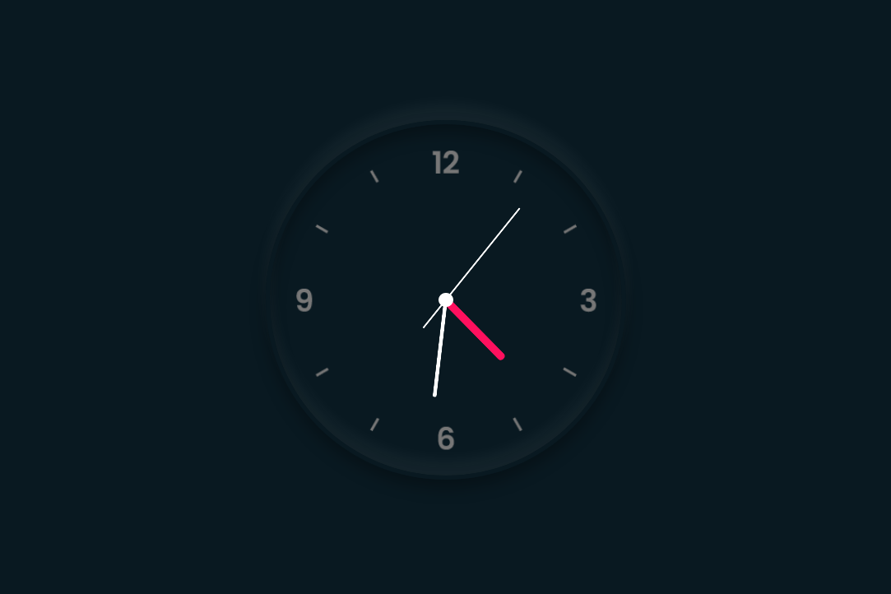

## A Neomorphic Clock
made using HTML5, CSS3, JS only, with the help of [Online Tutorials - Youtube](https://www.youtube.com/channel/UCbwXnUipZsLfUckBPsC7Jog)
This website is responsive.

### Preview 

### Future plans:
<ul>
    <li>Light mode, Amoled mode</li>
    <li>Digital Clock</li>
    <li>Stopwatch</li>
    <li>Countdown Timer</li>
    <li>Ticking Hands (Toggle)</li>
    <li>Glassmorphic Design(Toggle)</li>
</ul>
